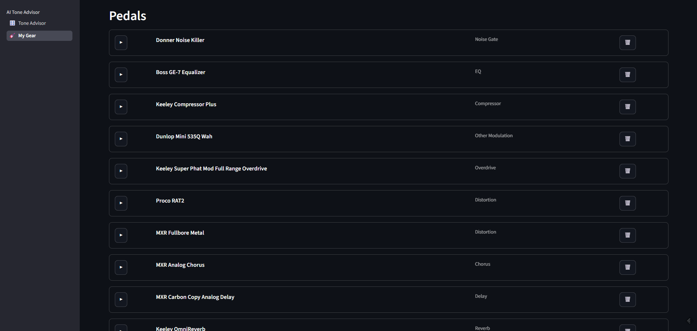
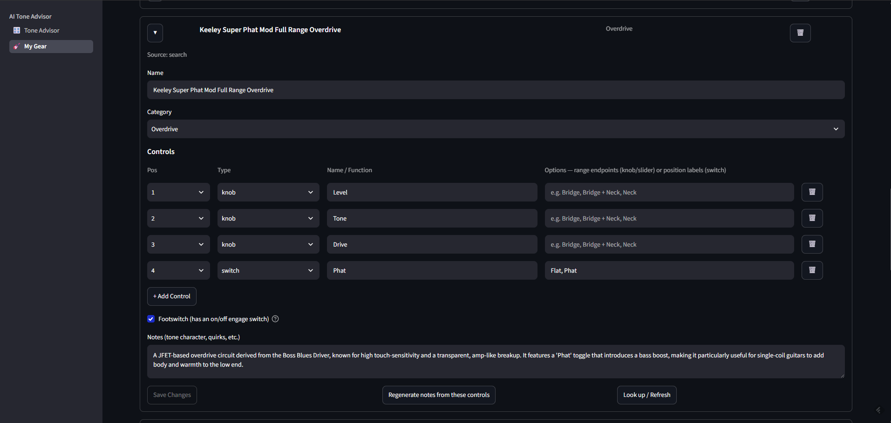
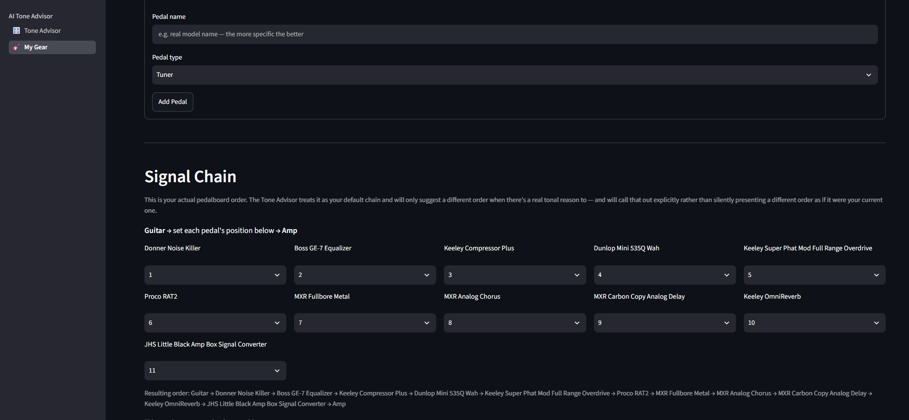
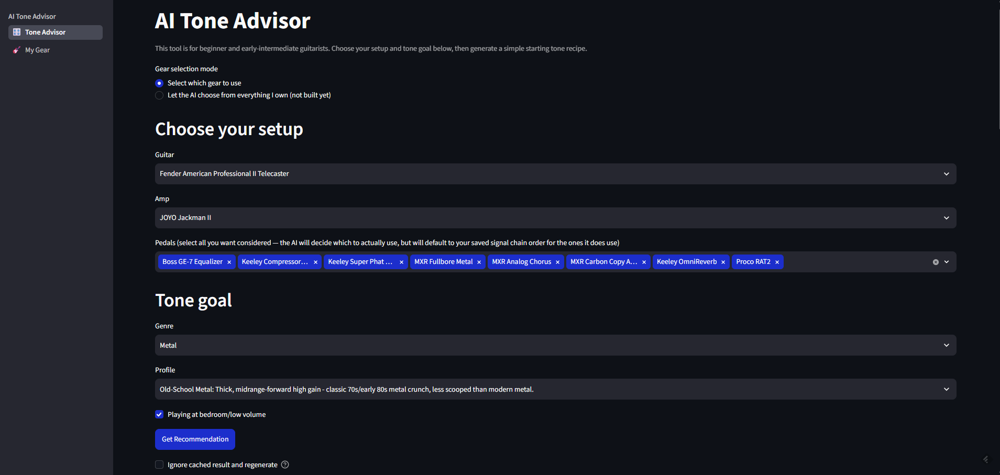
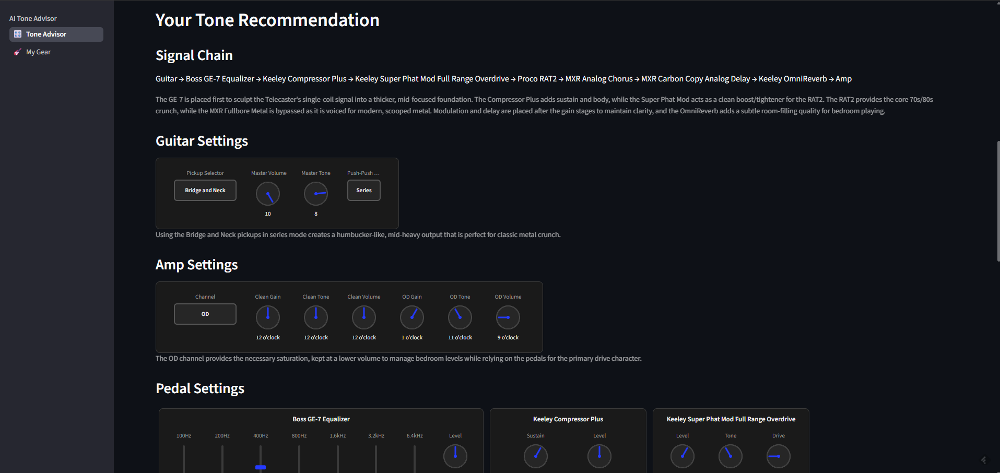
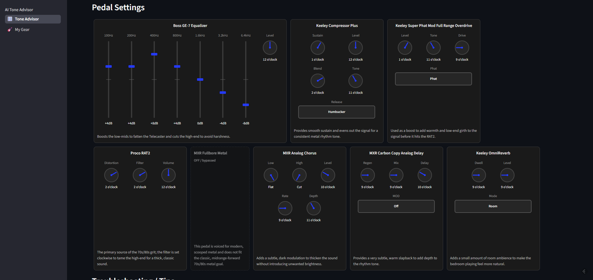
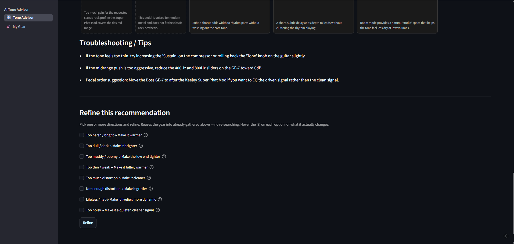
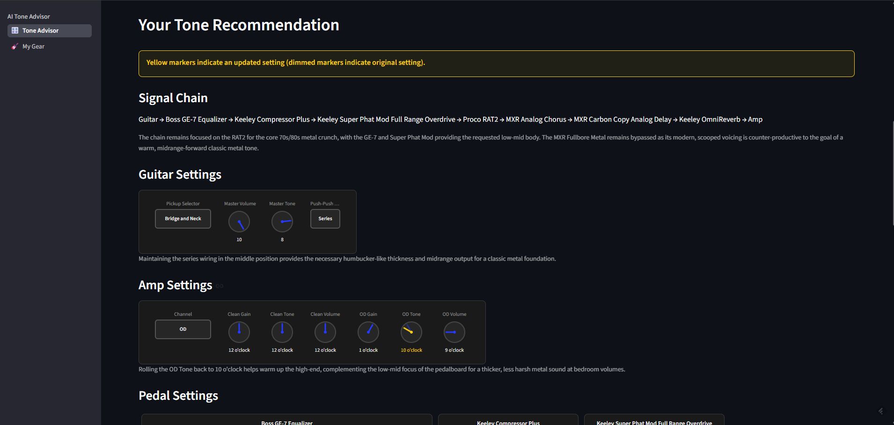
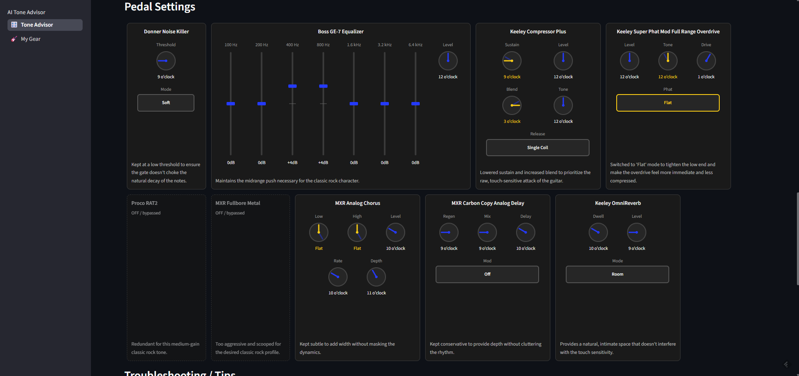
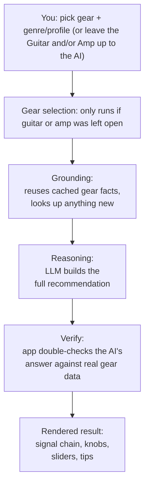

# Guitar Tone Advisor - LLM integration
**A tool that reasons over real, specific gear, using an LLM with structured output and a live web-search tool to suggest gear-specific settings for a given tone goal.**

---

## How it started

This project originally started a few years ago, just to explore what kinds of things I could accomplish with Python. The "Tone Scenario Builder - Beginner Edition" asked players to describe their gear in broad categories: guitar pickup layout (SSS/HH/HSS/HSH), a general amp gain range (gain, roughly, is how much distortion or 'grit' an amp or pedal can produce), and which *types* of effects pedals they had in their signal chain (Compressor, Overdrive, Chorus, Reverb...) and select a general type of sound they were going for (Rock, Metal, Pop...), so the app could suggest approximate settings appropriate for that goal using a complex tangle of rule-based logic.

That approach ran into a wall pretty quickly. Reasoning generically about gear by *category* is very general, when the reality is that different pedals in a single category can behave *very* differently from each other: three different "overdrive" pedals, for example, will often have different controls, different levels of gain they can produce, and characteristics or quirks unique to each. Even trying to account for that in a limited sense meant a lot of special-case logic added to an already complicated tangle of rules.

Fast-forward to now, when I decided I wanted to start learning to integrate AI tooling and integration, and this felt like a good candidate for reworking in a way that would allow me to build those skills. First, it would allow me to pull in much more gear-specific information as a foundation to build on. Second, I figured that an LLM would be able to use that information far more dynamically than a 'rules engine' could.

This write-up is about building the structure needed to accomplish that: what I tried, what broke, and *why* each part ended up being built the way it did.

---

## What it does

The idea was to build a tool that beginner or beginner-intermediate guitarists could enter their gear into, and use to get some good starting points to use as settings, depending on what type of tone/sound they were trying to get from the equipment they had. I used my own guitars, amps, and pedals as the test data throughout development so that I would have concrete examples to check against.

#### Setting up your gear. Each guitar, amp, and pedal a user owns gets individually added and looked up (and edited, if necessary) on the 'My Gear' page as the first step, to build the foundation for the recommendations that come later.

The guitars, amps, and pedals are listed in sections (Pedals section shown):

A pedal expanded to show details:

The current order of the user's pedals:
 

#### Getting a recommendation. Pick your guitar and amp - or let the AI pick for you - choose which pedals you want taken into consideration, and set a genre and 'profile' (sub-genre).
Guitar and amp each default to a dropdown selection populated with options from the My Gear page. If you have more than a single guitar or amp entered, each of these fields also displays a toggle ("Let the AI choose...") that swaps the dropdown for a checklist of everything you own in that category, all selected by default.

Gear, genre, and profile selected, with the Guitar field left to the AI:

The result comes back as a visually represented breakdown with short explanations for each, rather than a block of text. If the AI picked a Guitar or Amp (or both), the reasoning for that selection is shown above the settings for that piece of gear.

Guitar and amp settings rendered as knob/switch graphics:

Per-pedal settings:

Troubleshooting / tips and 'refinement' controls:

#### Optional refinement without starting over. Select something like "Too muddy / boomy → Make the low end tighter" or "Too thin / weak → Make it fuller, warmer" to have the app take what it initially provided and make some relevant changes.

Guitar and amp settings after a refinement pass:

Pedal settings after that same refinement:

---

## How it works (architecture)

At a high level, a request for settings goes through four stages:

**1. Your gear gets entered and verified first, as specific models.** Before any recommendation happens, you build a persistent list of what you actually own. Each item is looked up individually and stored with its own real controls, so the app never falls back on generic assumptions about what a pedal of that general type is usually like. If a lookup gets something wrong, it's directly editable, and a correction from you is treated as ground truth from then on.

**2. You select which guitar, amp, and pedals you are currently working with - or leave the Guitar and/or Amp for the AI to decide from the gear you own. ** From there, you select a genre and profile, and indicate whether or not you are playing at low ("bedroom") volumes.

**3. Gear selection (conditional). This step only runs if the Guitar field, the Amp field, or both were left open to more than one candidate. If it does run, a lightweight LLM call narrows each open field down to one item using the goal and information about the specific guitars/amps to make a recommendation before the Reasoning call that determines specific settings.

**4. Grounding.** This runs on every recommendation request, but for gear you've already added and looked up on My Gear, it's essentially instant; the app just confirms nothing new needs to be looked up, without calling the model or running a search. It only does actual work for gear that was added but never looked up: for well-known gear, it can answer from what it already knows, and for anything less certain, it runs a real web search and saves the result so that specific item never needs looking up again.

**5. Reasoning.** A second LLM call generates the recommendation, which must fill in an exact predefined structure: one entry per guitar, amp, and pedal, with named controls and numeric positions.

**6. Verifying the LLM's output.** The app takes the structured answer, rebuilds the signal chain from your saved pedal order to ensure it is rendered correctly, and cross-checks fields like amp channel or pickup selection against the verified facts from step 2, correcting anything that drifted.

**7. Rendering.** The final, verified structure becomes the knob/slider/switch graphics displayed, plus a short 'reasoning' text for each choice.

---

## Design decisions: What I tried, what broke, and what I changed

This is where most of the actual learning happened. A few of the decisions that shaped the architecture so far:

### Gear as specific, verified items instead of generic categories
This addressed one of the largest issues in the original attempt. Rather than reasoning about "an Overdrive pedal" in a generic sense, every gear item a user enters is looked up and verified individually. Real control names, layout, and quirks, cached from then on as input for a settings request.

### Facts + player experience
Getting the specs right is the first step, but a lot of useful gear knowledge lives in how people describe using it. Things like a knob that is extremely sensitive to adjustments, a mode or setting many players typically avoid, or a common perception about the tonal characteristics of a piece of gear might be out there, but won't be on a spec sheet. The grounding step asks for two different kinds of information, sourced two different ways: facts from manuals and spec sheets as a foundation, and "practical tips" pulled from reviews and hands-on discussions. The model is instructed to consider those tips (when available) when suggesting settings.

### Two different LLM setups for the grounding step
I initially configured the model to search if it needed to *and* answer in a specific structure, but trying to do both at once didn't seem reliable. I ended up splitting this step into two separate calls: one allowed to search and gather information, and the other shaped that information into the structure I needed.

### Letting the model decide *when* to search, instead of always searching
Since I was using a free-tier search API, I told the model to answer from its own knowledge when confident and only search if it wasn't, to avoid running into monthly caps.

### Double-checking the AI's own answer
Even though the model has to answer in the exact structure I need, that only guarantees the shape of the answer, not that every specific value inside it is actually correct. After getting a recommendation back, the app doesn't just take it at face value: it re-checks certain fields, like which amp channel or guitar pickup position was chosen, against the verified facts gathered during grounding, and corrects anything that doesn't actually match a real option on that gear. It also rebuilds the pedal order from what's actually saved on the My Gear page, rather than trusting that the model kept it in the right order on its own.

### Giving the model a consistent way to describe every kind of control
Every recommended knob, slider, and switch gets rendered as an actual graphic rather than just described in text, which meant the model's answer needed to be exact and consistent, not just descriptive ("turned up a bit" isn't something a graphic can render). For knobs and sliders, that meant giving the model a specific mapping in the prompt (for example, telling it that a "9 o'clock" position corresponds to a specific numeric value), so its answer translates directly into where the graphic actually points. Switches and buttons don't sit on a dial at all, so they needed a different rule: instead of a position, the model has to pick from the real, exact option names that specific control actually has (an actual mode name like "Spring" or "Plate," not a description of one), which the app then displays as-is.

---

## What broke: testing with real gear
I kept a running log of issues I ran into while building this. A few of the notable ones:

- Recommended settings sometimes left out a control entirely: a knob, slider, or switch the gear actually had, just missing from the model's answer, with nothing catching it. The fix was adding a general check after the model responds: compare its answer against the gear's real, verified list of controls, and restore anything missing using the value from a prior recommendation if this was a refinement, or a sensible default otherwise. Essentially, this forced controls the model didn't think of as 'relevant' (and thus ignored) to still show up as existing controls.

- Push-pull and push-push knob switches (a knob that doubles as a switch when pulled or pressed, most commonly used for a guitar's coil-split, which changes a humbucker pickup to sound closer to a single-coil) sometimes got left out of the model's own reasoning entirely, even though the recommendation still looked complete. A safety-net elsewhere in the code was quietly filling in a default value whenever this happened, so nothing appeared missing on the surface. Part of the fix was an explicit instruction telling the model this kind of control is a real, required decision, not an optional one. But part of it was structural: originally, a control like this was represented as one combined entry, knob-and-switch-function together, which made it easy for the switch half to get lost or overlooked. Splitting it into two separate, individually tracked controls - the knob itself, and its push-pull function as its own switch - made the switch function something the model (and the app's own gear data) had to account for on its own, rather than something that could be folded into the knob's entry.

- Prompt engineering wasn't always the best fix (or at least didn't work in isolation). Since gear lookups often describe something's controls by function and don't include a physical left-to-right layout, the app didn't always display the controls in the expected order. To address this, I implemented manual reordering of the controls on the My Gear page. The rendered controls always respect the order set in the gear details.

- In general, I found that fixes asking the model to double-check its own output were often the least reliable. Code-level fixes that enforced certain rules or structure typically held up better in testing.

---

## Tech stack

 - LangChain: chains, structured output, and tool-calling
 - Google Gemini API (free-tier): the underlying model for grounding and reasoning
 - Tavily (free-tier): web search tool for fact-finding
 - Streamlit: UI, multi-page navigation
 - Python/Pydantic: schema-enforced structured data

---

## What's next

 - **Named, saved tone scenarios.** Let a result be saved under a name and reloaded later from a dropdown, instead of only being reachable by re-entering the same gear combination and tone goal.
 - **Direct control editing before saving.** Let the recommended knob/slider/switch settings be adjusted by hand after the fact. Use the AI's recommendation as a starting point, tweak what needs tweaking, and save that as the named tone rather than the unedited original.
 - **Default gear.** Let a guitar or amp be marked as the default when you own more than one of each, so the advisor pre-selects it instead of defaulting to first-entered every time.
 - Longer term, this project is step two in a deliberate progression — the next stage moves from LangChain reasoning-plus-tools into retrieval-augmented generation with a real vector database, building toward a flagship RAG project.
